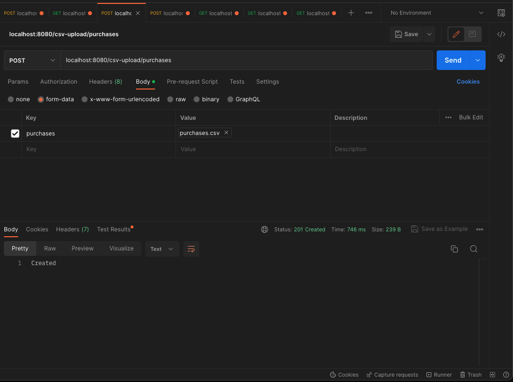
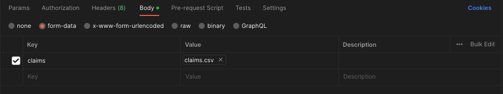

# Part 1, Data

The uploaded CSV data is stored in a PostgreSQL Database. An individual endpoint was created for each of the different CSVs. Follow the details in the following sections after the application is up and running locally.

> NOTE: Because not all validation is in place it is recommended to upload the CSV file in order of `customers` then `purchases` and finally `claims`.

## Connecting to a GUI

The tool that I used for local testing was [Postico](https://eggerapps.at/postico2/). The connection values can be found in the project directory structure at the root of the project in `docker-compose.yml`. They are hard coded in because there was no need to plan ahead for deployment.

```
environment:
  POSTGRES_USER: dockerpguser
  POSTGRES_PASSWORD: t3st3r0fThings!
  POSTGRES_DB: challenge_solution
  POSTGRES_HOST: localhost
```

## CSV Upload Endpoints

I recommend Postman for testing the CSV Upload endpoints. For each endpoint follow these same steps to test the upload of the corresponding CSV.

1. enter in the appropriate URL
    - 
1. click on the **Body** tab under the URL
1. select the `form-data` from the list of options
1. under the `Key` column if you hover over the right side of the first field/cell you'll see an option show up that says `Text`
    - click on the `Text` option and select `File`
    - to the right in the in the `Value` column you should now have the option to `Select a File`
    - 


## Customers


**URL path:**
- `/csv-upload/customers`


> NOTE: Data file can be found at `database/data-files/customers.csv` in the project directory.


## Purchases



**URL path:**
- `/csv-upload/purchases`


> NOTE: Data file can be found at `database/data-files/purchases.csv` in the project directory.


## Claims


**URL path:**
- `/csv-upload/claims`


> NOTE: Data file can be found at `database/data-files/claims.csv` in the project directory.



## Data Structure

The ERDs were created using [dbdiagram](https://dbdiagram.io/). The scripts below are [DBML](https://dbml.dbdiagram.io/docs/) (database markup language) that is used on [dbdiagram](https://dbdiagram.io/) in order to render the ERDs. The below scripts can be copied and pasted into the [dbdiagram](https://dbdiagram.io/) app to render the ERDs that are depicted below.

### Basic Structure

A more basic data structure following strictly the Customer, Purchases, and Claims table structure from the challenge instructions.


*[DBML](https://dbml.dbdiagram.io/docs/) script for [dbdiagram](https://dbdiagram.io/):*
```sql
// Use DBML to define your database structure
// Docs: https://dbml.dbdiagram.io/docs

Table customers {
  id uuid [primary key]
  first_name varchar
  last_name number
  created_at timestamp
  updated_at timestamp
}

Table purchases {
  id uuid [primary key]
  invoice varchar
  total_sale_amount money
  invoice_date timestamp
  delivery_date timestamp
  name varchar
  description text
  sku varchar
  protection_plan_name varchar
  protection_plan_duration integer
  protection_plan_price money
  protection_plan_sku varchar
  protection_plan_period varchar
  customer_id uuid
  created_at timestamp
  updated_at timestamp
}

Table claims {
  id uuid [primary key]
  status varchar
  solution varchar
  created_at timestamp
  updated_at timestamp
  customer_id uuid
  product_purchase_id uuid
  product_condition varchar
  damage_description text
  damage_date timestamp
}


Ref: "customers"."id" < "claims"."customer_id"

Ref: "purchases"."id" < "claims"."product_purchase_id"

Ref: "customers"."id" < "purchases"."customer_id"
```

> NOTE: Probably need a junction table for `claims` and `purchases` because it seems like it is meant to be a **many to many** relationship.

### More Complex Structure


*[DBML](https://dbml.dbdiagram.io/docs/) script for [dbdiagram](https://dbdiagram.io/):*
```sql
// Use DBML to define your database structure
// Docs: https://dbml.dbdiagram.io/docs

Table customers {
  id uuid [primary key]
  first_name varchar
  last_name number
  created_at timestamp
  updated_at timestamp
}

Table purchases {
  id uuid [primary key]
  invoice varchar
  total_sale_amount money
  invoice_date timestamp
  delivery_date timestamp
  product_id uuid
  protection_plan_id uuid
  customer_id uuid
  created_at timestamp
  updated_at timestamp
}

Table claims {
  id uuid [primary key]
  status_id integer
  solution_id integer
  created_at timestamp
  updated_at timestamp
  customer_id uuid
  product_purchase_id uuid
  product_condition_id integer
  damage_description text
  damage_date timestamp
}

Table products {
  id uuid [primary key]
  name varchar
  description varchar
  sku varchar
  created_at timestamp
  updated_at timestamp
}

Table protection_plans {
  id uuid [primary key]
  protection_plan_name varchar
  protection_plan_duration integer
  protection_plan_price money
  protection_plan_sku varchar
  protection_plan_period varchar
  created_at timestamp
  updated_at timestamp
}

Table status_options {
  id integer [primary key]
  status_name varchar
  created_at timestamp
  updated_at timestamp
}

Table solution_options {
  id integer [primary key]
  solution_name varchar
  created_at timestamp
  updated_at timestamp
}

Table product_condition_codes {
  id integer [primary key]
  code varchar
  created_at timestamp
  updated_at timestamp
}

Ref: "product_condition_codes"."id" < "claims"."product_condition_id"

Ref: "solution_options"."id" < "claims"."solution_id"

Ref: "status_options"."id" < "claims"."status_id"

Ref: "customers"."id" < "claims"."customer_id"

Ref: "purchases"."id" < "claims"."product_purchase_id"

Ref: "customers"."id" < "purchases"."customer_id"

Ref: "protection_plans"."id" < "purchases"."protection_plan_id"

Ref: "products"."id" < "purchases"."product_id"
```

