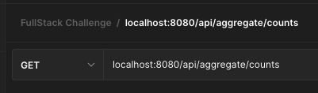

# Part 2, API

The API application is using Node.js with [Express](https://www.npmjs.com/package/express) and for the database connection it is leveraging the [PG npm dependency](https://www.npmjs.com/package/pg). The server is using the Typescript built in compiler and [Nodemon](https://www.npmjs.com/package/nodemon) for live refresh of the build.

After the application is running locally you should be able to access the API endpoints as outlined below.

> NOTE: Make sure you have already uploaded the CSV files to the database as outlined in the [Data Documentation](../database/README_DATA.md).

## Customers


**URL path:**
- `/api/customers`
**URL query params:**
- `page`
- `limit`

> NOTE: If the `page` and `limit` values are not defined as part of the URL path then `page` with default to `1` and `limit` will default to `10`.


The response from `/api/customers` is a paginated object with a list of customers.


*Example:*
```json
{
  "totalItems": "100",
  "totalPages": 10,
  "currentPage": 10,
  "customers": [
    {
      "id": "6a133281-553e-41ba-994d-61744d5bd384",
      "firstName": "Dulce",
      "lastName": "Weissnat",
      "createdAt": "2023-03-30T21:49:39.485Z",
      "updatedAt": "2023-03-31T15:38:28.126Z"
    },
    // ......
  ]
}
```

## Claims


**URL path:**
- `/api/claims/customers/:id`
**URL params:**
- `:id`

> NOTE: Provide the customer's UUID for the `:id` param in the url to retrieve all of the claims that are associated with that customer. This has the most accurate error messaging of the three endpoints.


The response from `/api/claims/customers/:id` is an object with the matching customer information and an array with all of the matching claims.

> NOTE: I did not have time to come back and add the appropriate joins to match up the purchase data with the claims.


*Example:*
```json
{
  "customer": {
    "id": "03f317a7-3559-4848-aabd-e83a27039eef",
    "firstName": "Isaac",
    "lastName": "Streich",
    "createdAt": "2023-03-30T21:49:39.501Z",
    "updatedAt": "2023-03-31T15:38:28.147Z"
  },
  "claims": [
    {
      "id": "2a0d29fe-71df-4cf6-b383-d65c78775df9",
      "status": "Under Review",
      "solution": "Replacement",
      "createdAt": "2023-03-30T21:49:41.245Z",
      "updatedAt": "2023-03-30T21:49:41.245Z",
      "customerId": "03f317a7-3559-4848-aabd-e83a27039eef",
      "productPurchaseId": "72f9d364-eb3d-447d-a711-23446e52a2cf",
      "productCondition": "MD",
      "damageDescription": null,
      "damageDate": "2023-03-09T00:00:00.000Z"
    },
    // ......
  ]
}
```

## Counts


**URL path:**
- `/api/aggregate/counts`



The response from `/api/aggregate/counts` is an object with the counts for the total number of records in the "purchases", "claims", and "customers" tables.


*Example:*
```json
{
  "totalCustomers": "100",
  "totalPurchases": "400",
  "totalClaims": "200"
}
```
